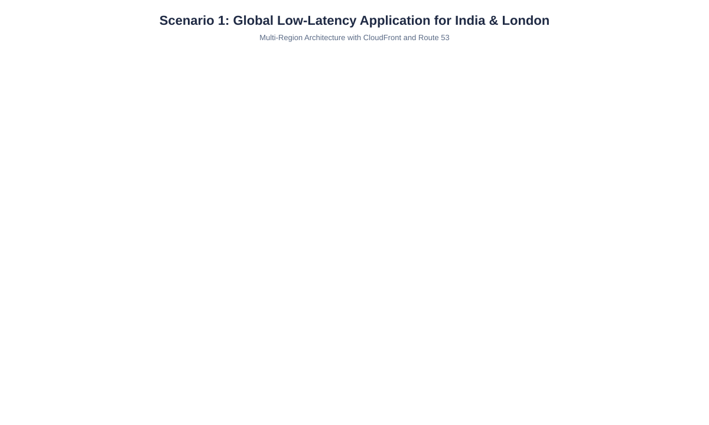
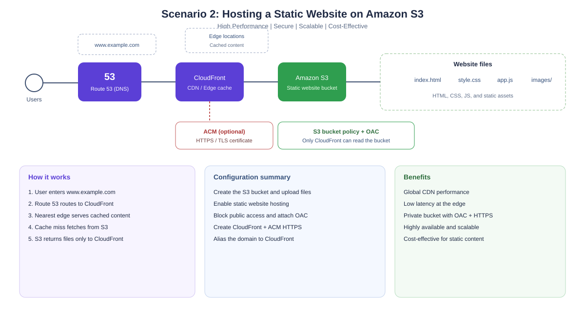

# AWS Architecture Scenarios

Three production-oriented AWS designs covering global latency, static hosting, and hybrid cloud.

| Scenario | Pattern | Core services |
| --- | --- | --- |
| [1. Global low-latency app](#scenario-1-global-low-latency-application-for-india--london) | Multi-region active-active | Route 53, CloudFront, ALB, Auto Scaling, EC2 |
| [2. Static website on S3](#scenario-2-hosting-a-static-website-on-amazon-s3) | Origin-locked CDN | Route 53, CloudFront, S3, ACM, OAC |
| [3. Hybrid cloud for legacy apps](#scenario-3-hybrid-cloud-solution-for-legacy-applications) | App in AWS, database on-prem | VPC, ALB, VPN / Direct Connect, WAF, KMS |

---

## Scenario 1: Global Low-Latency Application for India & London

Multi-region architecture with CloudFront and Route 53 latency-based routing. Indian users resolve toward Mumbai (`ap-south-1`); London users resolve toward `eu-west-2`. Each region runs its own ALB and a Multi-AZ Auto Scaling Group.



### Approach

- **Amazon CloudFront (CDN):** Place CloudFront in front of the application so static assets (images, CSS, JS) are cached at edge locations near India and London, cutting round-trip time for users in each region.
- **Multi-region deployment:** Run the application in two AWS regions — `ap-south-1` (Mumbai) for Indian users and `eu-west-2` (London) for UK users. Each region has its own Application Load Balancer and an Auto Scaling Group spread across at least two Availability Zones.
- **Route 53 latency-based routing:** DNS resolves each request to the region with the lowest latency, with health checks attached so traffic fails over if a region goes down.
- **Optional — AWS Global Accelerator:** Improves performance further using Anycast IPs and the AWS private backbone. Useful for non-HTTP or extra latency-sensitive traffic.
- **Database:** Use Aurora Global Database or DynamoDB Global Tables so each region can read/write locally with low replication lag, instead of sending every request across continents to a single database.

### Implementation flow

1. Create VPCs in both regions.
2. Place EC2 (or containers) behind regional ALBs.
3. Attach Auto Scaling Groups across at least two AZs per region.
4. Create a CloudFront distribution in front of the regional origins.
5. Add Route 53 latency-based records with health checks.
6. Enable global database replication if the workload is stateful.

### Key benefits

- Low latency for users in India and London
- Global content delivery via CloudFront edge locations
- Automated routing with Amazon Route 53
- High availability with Multi-AZ deployment
- Scalable with Auto Scaling
- Resilient, fault-tolerant architecture

---

## Scenario 2: Hosting a Static Website on Amazon S3

High-performance, private-origin static hosting. The S3 bucket stays locked down; CloudFront is the only reader, via Origin Access Control. Route 53 and ACM provide the custom domain and HTTPS.



### How it works

1. Users enter the domain (for example, `www.example.com`).
2. Route 53 resolves the domain and routes to CloudFront.
3. CloudFront serves content from the nearest edge location (cached content for faster delivery).
4. If the object is not cached, CloudFront fetches it from S3.
5. The S3 bucket hosts the static files and returns them only to CloudFront.

### Configuration steps

1. Create an S3 bucket in a region close to the primary audience.
2. Upload the website files (`index.html`, CSS, JS, images).
3. Enable Static website hosting and set the index document (and optional error document).
4. Block public access. Prefer Origin Access Control so only CloudFront can call `s3:GetObject`.
5. Test the S3 website endpoint before attaching a custom domain.
6. Create a CloudFront distribution with S3 as the origin and attach an ACM certificate for HTTPS.
7. Create a Route 53 alias (`A` / `AAAA`) pointing at the CloudFront distribution.
8. Open the site over HTTPS on the custom domain.

### Domain and CDN notes

- Point the domain at CloudFront, not the S3 website endpoint. S3 website endpoints do not serve HTTPS natively.
- ACM certificates for CloudFront must be requested in `us-east-1`.
- CloudFront improves global load times and reduces direct request volume (and cost) on the bucket.

### Benefits

- High performance with a global CDN
- Low latency via edge locations
- Secure access using OAC and HTTPS
- Highly available and scalable
- Cost-effective for static content
- Easy to manage and maintain

> Using CloudFront + S3 with Origin Access Control keeps the bucket private and the website secure.

---

## Scenario 3: Hybrid Cloud Solution for Legacy Applications

The application tier moves to AWS for high availability and scale. The database stays in the corporate data center and is reached over an encrypted Site-to-Site VPN or AWS Direct Connect.


### Connectivity

Establish a secure link between AWS and the on-premises data center:

- **Site-to-Site VPN** — fast to stand up, encrypted, cost-effective
- **AWS Direct Connect** — dedicated, lower-latency path for production database traffic

Use redundant tunnels or circuits so the link itself is not a single point of failure.

### Migration

Rehost or containerize the application onto EC2 (or ECS/EKS). Deploy it in private subnets across at least two Availability Zones. The database remains on-premises and is reached over VPN or Direct Connect.

### Security

- **In transit:** TLS for client-to-app and app-to-database traffic; encryption on the VPN or Direct Connect link.
- **At rest:** KMS encryption on EBS and any cloud storage; encryption enabled on the on-premises database.
- **Access control:** IAM roles with least privilege, tight Security Groups / NACLs (only app servers may reach the database port), credentials in Secrets Manager rather than in code.
- **Perimeter:** AWS WAF in front of the application, plus the on-premises firewall in front of the database tier.
- **Monitoring:** CloudWatch, CloudTrail, AWS Config, and GuardDuty.

### Eliminating single points of failure

- The ALB distributes traffic across healthy instances in multiple AZs.
- Auto Scaling replaces unhealthy instances and scales to actual demand, which also fixes inefficient resource allocation.
- Route 53 health checks detect failures and steer traffic around them.
- On-premises primary and replica databases keep the data tier highly available.

### How it works

1. Users access the application via Route 53.
2. Traffic is filtered by AWS WAF and sent to the ALB.
3. The ALB distributes traffic to healthy EC2 instances across AZs.
4. Application servers connect securely to the on-premises database over VPN or Direct Connect.
5. The database processes requests and returns responses over the private link.

### Key benefits

- High availability through Multi-AZ application deployment
- Scalability as Auto Scaling follows traffic
- Security with encrypted VPN, Security Groups, IAM, WAF, and KMS
- No single point of failure across redundant components
- Pay-as-you-go cost for cloud resources
- Centralized monitoring, logging, and alerts

> This architecture separates the application (in AWS) from the database (on-premises), keeps data encrypted in transit and at rest, removes single points of failure, and scales the app tier independently of the legacy database.

---

## Repository layout

```text
.
├── README.md
└── docs/
    └── images/
        ├── scenario-1-multi-region.svg
        ├── scenario-2-s3-static-website.svg
        └── scenario-3-hybrid-cloud.svg
```
